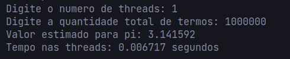
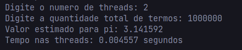
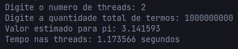
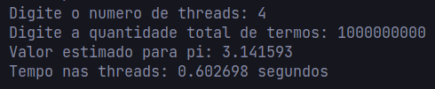

# Testes

## Configurações da Máquina

### Sistema Operacional

Linux

#### Distribuição

Garuda

#### Kernel

6.8.2-zen2-1-zen

### Processador

11th Gen Intel(R) Core(TM) i5-1135G7 (4 núcleos e 8 threads)

### Memória Principal

16GB DDR4

### Memória Secundária

512GB SSD

## Resultados

### Com 10e6 termos

### Com 10e9 termos

## Conclusão

- Usando da biblioteca pthreads com threads implementadas em modo preemptivo, pois em momento algum no código uma thread explicitamente cede o controle de um recurso para outra thread (muito pelo contrário as threads disputam entre si pelo acesso a variável 'pi'), é possível observar uma redução considerável do tempo gasto para completar a tarefa quando dividindo em threads.
- Linux (assim como Windows) se utiliza do modelo de thread 1:1 (uma para uma) onde uma thread de usuário é mapeada para uma thread no kernel o que leva a redução de tempo nas threads (de aproximadamente 50% sempre que se dobra o número de threads).
